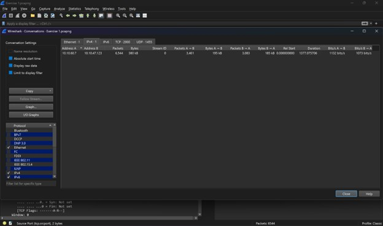
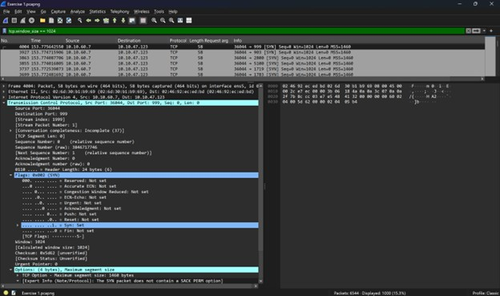
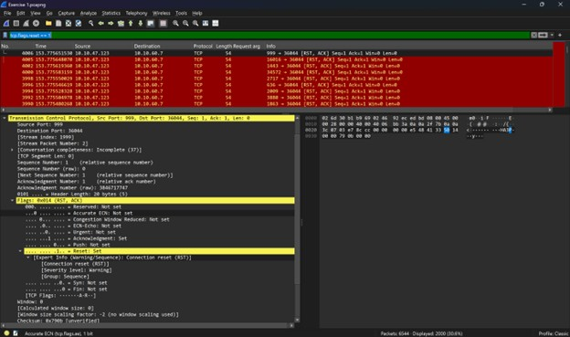
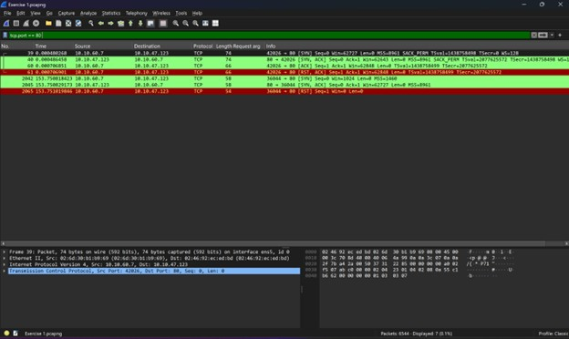
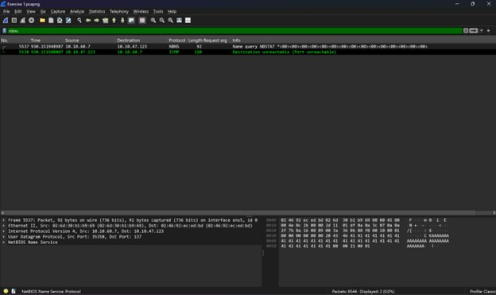

# 🚨 Network Anomaly Analysis: Detection and Deconstruction of Nmap Scanning

## 📖 1. Introduction
In the modern cyber threat landscape, timely detection of network reconnaissance is a critical step in preventing a full-scale attack. This folder presents an in-depth analysis of network traffic (based on the `Exercise.pcapng` packet capture. TryHackMe - Wireshark: Traffic Analysis) to identify suspicious activity, determine the attacker's toolset, and assess the vulnerability of the target infrastructure.

**🎯 Objective:** The primary goal of this research is to demonstrate a SOC analyst's approach to incident investigation through **Packet-Level Analysis**. It showcases how to transform raw network data into actionable Indicators of Compromise (IoCs) and behavioral patterns.

---

## 🛠️ 2. Methodology
The protocol analyzer **Wireshark** was used to conduct this investigation. The core methods for detecting anomalies included:

* 📊 **Statistical Analysis (Conversations):** Evaluating the overall volume and intensity of traffic between nodes to detect abnormal spikes in activity.
* 🚩 **TCP Flags Analysis:** Tracking connection attempts and analyzing the target operating system's reactions (using filters like `tcp.flags.syn`, `tcp.flags.reset`).
* 📩 **ICMP Analysis:** Identifying the results of connectionless protocol (UDP) scanning by analyzing *Destination Unreachable* responses.
* 👣 **Passive Fingerprinting:** Examining specific packet header parameters (e.g., `tcp.window_size`) to identify the attacker's utilities based on their "digital footprint" without active interaction.

---

## 📚 3. Theoretical Basis: TCP Flags
To deeply understand network anomalies, it is essential to comprehend the structure of TCP communication. Think of every network packet as an envelope. TCP flags are specific instructions (stickers) on that envelope telling the receiving computer how to process it. In Wireshark, these are found under `Transmission Control Protocol -> Flags`. Each flag is a single bit (0 = Off, 1 = On).

* 👋 **SYN (Synchronize):** Used to initiate a connection. A flood of SYN packets from one address to various ports is a clear indicator of port scanning.
* ✅ **ACK (Acknowledgment):** Confirms the receipt of a packet. Almost every packet after the initial connection establishment carries this flag.
* 🚪 **FIN (Finish):** Used to gracefully terminate a session.
* 💥 **RST (Reset):** An aggressive connection termination. Usually an answer from a closed port or a signal of a connection drop.
* ⏩ **PSH (Push):** Tells the system to immediately pass data to the application layer without buffering.
* 🚨 **URG (Urgent):** Indicates that the data in the packet has the highest priority.

**The standard Three-Way Handshake looks like this:**
1.  **Client:** `SYN` *(I want to connect)*
2.  **Server:** `SYN + ACK` *(I hear you, I'm ready)*
3.  **Client:** `ACK` *(Great, let's start transmitting)*

---

## 🔎 4. Investigation Steps
In this section, we break down the network anomalies discovered in the packet capture file. This step-by-step analysis reconstructs the attacker's logic.

### 📈 4.1. Statistical Attack Profile (Conversations)
The first step in the investigation is assessing the overall scale of network interaction. For this, I utilized Wireshark's built-in tool: `Statistics -> Conversations` (IPv4 tab).

* **Observation:** I captured an intense data exchange between host `10.10.60.7` (Attacker) and `10.10.47.123` (Target). The total number of packets in the session reached **6544**, while the total transferred data volume was merely **379 KB**. The attack lasted approximately 23 minutes.
* **Analytical Conclusion:** > This abnormal ratio (a massive number of packets with minimal payload—averaging ~58 bytes per packet) is an undeniable Indicator of Compromise (IoC) of automated network scanning. The attacker was not transmitting actual data; they were generating thousands of "empty" requests purely for Port Discovery.

### 🖃 4.2. Technical Tool Identification (Nmap Fingerprinting)
Having confirmed the scanning activity, I identified the specific tool used by the attacker relying on digital footprints within the TCP headers.

* **Methodology:** Applied the filter `tcp.window_size == 1024`.
* **Observation:** The output revealed hundreds of packets from the attacker's host (`10.10.60.7`) with a strictly hardcoded TCP Window Size of exactly 1024 bytes.
* **Analytical Conclusion:** > Modern operating systems typically use dynamic and much larger Window Size values to optimize data transfer. The static value of `1024` is a well-known technical footprint of the popular **Nmap** network scanner during certain scan types (e.g., Stealth SYN Scan). This allows us to confidently classify the incident as automated reconnaissance powered by Nmap.

### 🛡️ 4.3. Port State Analysis (RST/ACK Responses)
To understand how vulnerable the network is and how it reacts to external probing, I analyzed the return traffic from the target.

* **Methodology:** Analyzed a specific packet (e.g., **#4006**) using the filter `tcp.flags.reset == 1`.
* **Observation:** Upon the attacker's attempt to connect to port **999**, the target machine responded with a packet containing **[RST, ACK]** flags. The packet details clearly show the `Reset: Set` bit (value 1). The response time was measured in fractions of a millisecond.
* **Analytical Conclusion:** > 
    1. The target machine is active ("alive"), and its TCP/IP stack is functioning correctly.
    2. Port 999 is **Closed** but **Not Filtered**. This is an "active refusal" generated directly by the operating system.
    3. The instantaneous response proves the absence of a network Firewall or IPS operating in "Drop" mode on the traffic path. The OS processes the scanner's requests directly, making reconnaissance incredibly fast and highly informative for the attacker.

### 🤝 4.4. TCP Connect Scan Detection (Port 80)
A vital part of the analysis is determining the specific scan type applied to targeted services by observing the flag sequence.

* **Methodology:** Investigated traffic using the filter `tcp.port == 80`.
* **Observation:** A complete *Three-Way Handshake* was observed: the client sends a SYN, receives a SYN/ACK from the server, and concludes the connection setup with an ACK packet.
* **Analytical Conclusion:** > This behavior specifically characterizes a **TCP Connect (-sT)** scan. Unlike "stealth" scanning, the attacker uses standard system calls to establish a full connection here, which inevitably leaves prominent traces in the target server's application logs.

### 🕵️‍♂️ 4.5. Reconnaissance Phase: Target Deanonymization Attempt (NBNS)
Beyond basic Layer 4 port scanning, the log file reveals the attacker's attempts to conduct higher-level reconnaissance to identify the system.

* **Methodology:** Analyzed packets **#5537** and **#5538** using the filter `nbns`.
* **Observation:** In packet #5537, the attacker sends a specific wildcard query `NBSTAT *<00>...` via the NetBIOS Name Service protocol. The objective is to force the node to reveal its Hostname, Domain, and MAC address. However, in the immediate subsequent packet (#5538), the target replies with an `ICMP Destination unreachable (Port unreachable)` message.
* **Analytical Conclusion:** > The attempt at active target deanonymization via UDP port 137 (NetBIOS) failed. Despite the refusal, capturing these queries is critical for a SOC analyst. It confirms the attacker's escalation from mere port probing to targeted efforts aimed at identifying specific internal network assets.

---

## 💡 5. Conclusion & Recommendations

### 📋 Executive Summary
The conducted investigation irrefutably confirms targeted network reconnaissance against the host `10.10.47.123` originating from the attacking IP `10.10.60.7`. The attacker operated methodically:
1.  Initiated network mapping at the data link layer (Broadcast ARP requests).
2.  Attempted asset deanonymization using the NetBIOS protocol (NBNS).
3.  Executed massive port scanning across TCP and UDP protocols.

The consistent use of specific TCP header parameters (Window Size = 1024) allowed me to unequivocally identify the usage of the **Nmap** automated scanner.

### 🎯 Target Security Assessment
The return traffic analysis revealed that the target system is **unprotected** by an active Firewall that would block illegitimate requests. The victim's operating system directly handles the scanner's packets, generating immediate responses (RST for TCP and ICMP Unreachable for UDP). This significantly facilitates the attacker's job, allowing them to map open and closed services with maximum speed and accuracy.

### 🛡️ Mitigation Strategies
To prevent similar incidents and complicate future reconnaissance attempts, the following security measures are recommended:

1.  **Firewall Configuration (Drop Rule):** Switch network firewall rules to "Drop" mode for all unknown and unauthorized incoming connections. The absence of RST/ICMP replies will force the scanner to wait for timeouts, drastically slowing down the reconnaissance process.
2.  **Rate Limiting:** Implement limits on the number of incoming SYN requests from a single IP address per time unit. This protects the network from both rapid port scanning and potential SYN-Flood DDoS attacks.
3.  **Minimize Attack Surface:** If the NetBIOS protocol (UDP 137) is not mission-critical for internal business processes, it should be disabled at the operating system level.
4.  **IDS/IPS Implementation:** Configure Intrusion Detection Systems (e.g., Snort or Suricata) to trigger alerts upon detecting abnormal volumes of packets with small payloads and specific TCP window sizes (e.g., 1024 bytes).
